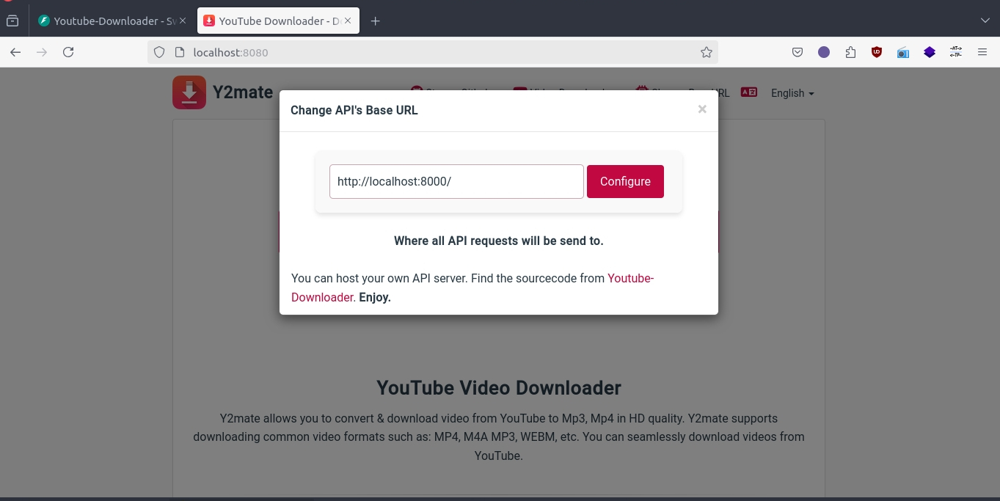

<h1 align="center">y2mate-clone </h1>

<p align="center">
<a href="LICENSE"></a>
<a href="https://github.com/Simatwa/y2mate-clone/releases"></img></a>
<a href="https://github.com/Simatwa/y2mate-clone/releases"></img></a>
<a href="https://github.com/psf/black"></a>
<a href="https://hits.seeyoufarm.com"></a>
</p>

Web-interface for [Youtube-Downloader-API](https://github.com/Simatwa/youtube-downloader-api) inspired by [y2mate.com](https://y2mate.com)

# Pre-requisites

- [Python version 3.10 or higher](https://python.org)
- [Git](https://git-scm.com/)

# Installation and Usage

- Clone repository and enter the project directory.

```sh
git clone --recurse-submodules https://github.com/Simatwa/y2mate-clone.git
cd y2mate-clone
```

- Install backend dependencies

```sh
cd backend
pip install -r requirements.txt
```

- Start the backend server

```sh
python -m fastapi run app
```

- On another terminal tab, start the frontend server from the root directory of the project

```
python -m http.server 8080 -d frontend
```

Then you can now access the web-interface from <http://localhost:8080>.

> [!TIP]
> You can interact with one run now at <https://y2mate-clone.vercel.app>

Change the Base URL of the API to point to the one we had setup before and enjoy the service.


<p align="center">

</p>

## How to serve both API and Frontend contents from one server

1. Navigate to the backend directory.

    ```sh
    cd backend
    ```

2. Create a **.env** file *(configuration file)*.

    ```sh
    cp configs/env/example .env
    ```

3. Update path to frontend directory in the`.env` file identified by key `frontend_dir`

    ```sh
    frontend_dir = ../frontend
    ```

4. Start the server

    ```sh
    python3 -m fastapi run app
    ```

    - Now both API and frontend contents will be served from <http://localhost:8000>

> [!NOTE]
> Purpose to checkout [Youtube-Downloader-API](https://github.com/Simatwa/youtube-downloader-api) to learn more about customizing the REST-API.

# License

- [x] [MIT](LICENSE)
