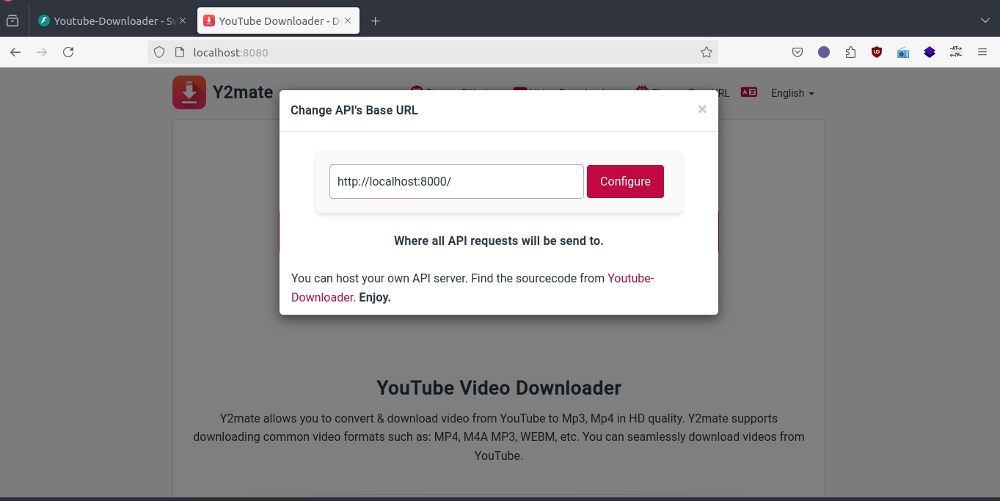

<div align="center">

# y2mate-clone 

[](LICENSE)
[](https://github.com/Simatwa/y2mate-clone/releases)
[](https://github.com/Simatwa/y2mate-clone/releases)
[](https://github.com/psf/black)
[](https://github.com/Simatwa/y2mate-clone)

Web interface for [Youtube-Downloader-API](https://github.com/Simatwa/youtube-downloader-api), inspired by the late [y2mate.com](https://web.archive.org/web/20250126032757/https://www.y2mate.com/en949)

</div>

https://github.com/user-attachments/assets/07bca8e0-1e63-4629-8936-2d4a15c0eda6

> [!IMPORTANT]
> It is with great gratitude that I maintain a clone of one of the **most legendary websites to ever exist**. While [its existence is now history](https://web.archive.org/web/20260311000109/https://y2mate.com/), we honor it, as its spirit has inspired many other projects, including this one. IFPI took down a tool, but never the spirit.

## Prerequisites

- [Python 3.10 or higher](https://python.org)
- [Git](https://git-scm.com/)

## Installation and Usage

**1. Clone the repository**

```sh
git clone --recurse-submodules https://github.com/Simatwa/y2mate-clone.git
cd y2mate-clone
```

**2. Set up the backend**

The backend is powered by [Youtube-Downloader-API](https://github.com/Simatwa/youtube-downloader-api). Install its dependencies using `uv`:

```sh
cd backend
pip install uv
uv venv
source .venv/bin/activate
uv sync
```

> [!TIP]
> Keep `yt-dlp` updated to avoid download failures caused by YouTube-side changes:
> ```sh
> uv pip install -U yt-dlp
> ```

**3. Start the backend server**

```sh
# While in backend directory
uv run python -m app run
```

**4. Start the frontend server**

On a separate terminal tab, from the root directory of the project:

```sh
cd frontend
python -m http.server 8080 -d frontend
```

The web interface will be accessible at <http://localhost:8080>.

> [!TIP]
> A live demo is available at <https://y2mate-clone.vercel.app>. Change the Base URL of the API to point to your own instance and enjoy the service.

<div align="center">

</div>

## Serving Both API and Frontend from One Server

1. Navigate to the backend directory:
```sh
   cd backend
```

2. Set the `frontend_dir` key in `config.yml` to point to the frontend directory:
```sh
   frontend_dir = ../frontend
```

4. Start the server:
```sh
   uv run python -m app run
```

Both the API and frontend will now be served from <http://localhost:8000>.

> [!NOTE]
> Check out [Youtube-Downloader-API](https://github.com/Simatwa/youtube-downloader-api) for full documentation on configuring and customizing the REST API backend.

## License

- [x] [MIT](LICENSE)